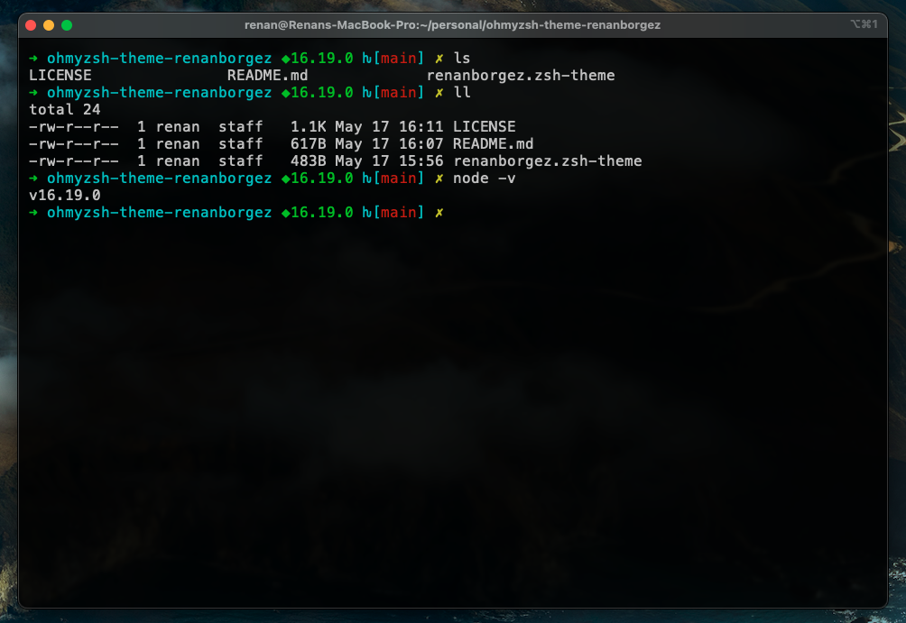

# ohmyzsh-theme-renanborgez

## Description

A minimalistic oh-my-zsh theme



## Features

- Shows git prompt
- Shows nodejs version (works with nvm)

## Install

1. clone repo: ```git clone https://github.com/renanborgez/ohmyzsh-theme-renanborgez```;
2. copy theme: ```cp ./ohmyzsh-theme-renanborgez/renanborgez.zsh-theme ~/.oh-my-zsh/themes/renanborgez.zsh-theme```;
3. modify rc: open ```~/.zshrc``` find ```ZSH_THEME``` edit to ```ZSH_THEME="renanborgez"```;
4. execute rc: ```source ~./zshrc```;

* see also: [Overriding and adding themes](https://github.com/ohmyzsh/ohmyzsh/wiki/Customization#overriding-and-adding-themes);
